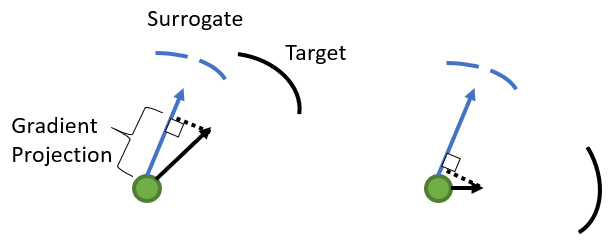

# Gradient-Projection-Regularization
Improving model's robustness to transfer attacks by regularizing projection of input gradients.

## How it works
Intuitively, transferability occurs when two models share similar decision boundary, and, it's known that input gradients reveal important information about the decision boundary under first-order approximation, which inspires us to boost robustness to transfer attacks by regularizing the projection of input gradients of the surrogate model and target model.




## Compared to other defenses
| Model | Clean Accuracy |FGSM(0.1,0.2,0.3) Accuracy|PGD(0.1,0.2,0.3) Accuracy|
| Normal Training | 99.1 | 70.2/38.2/19.3	| 53.1/13.1/3.4 |

## How to use
```
train_model.py
```
Used for model definition and training with different methods, see below.
```
training_method.py
```
Main implementation of gradient projection regularization, adversarial training, or other methods for robustness.
```
eval.py
```
Contains functions for robusness evaluation under different attacks or visualization.
```
pgd.py
```
Generating PGD adversarial examples, used for adversarial training.

## Dependencies
- tensorflow >= 2.0
- [adversarial robustness toolbox](https://github.com/Trusted-AI/adversarial-robustness-toolbox)(for evaluation)

